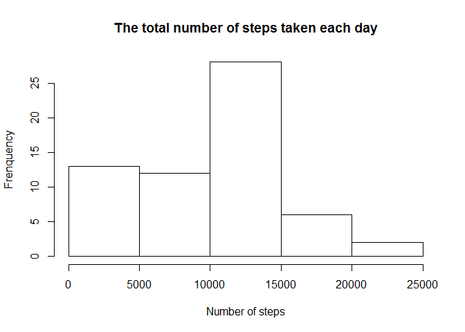
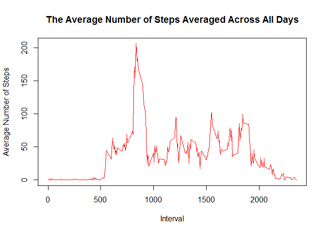
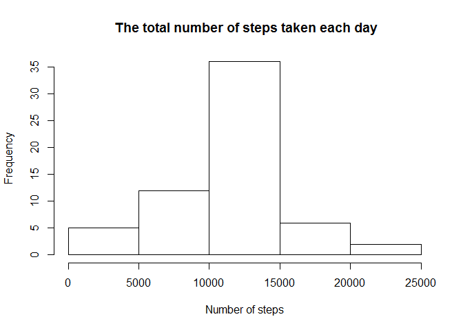
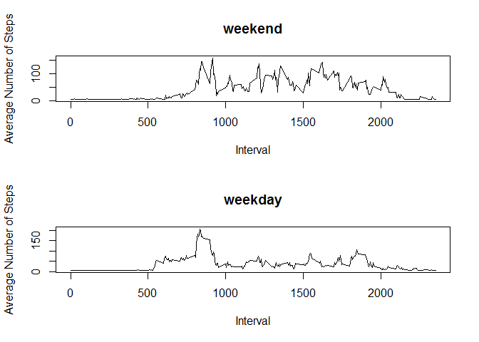

# PA1_template
Dong Zhang  
Tuesday, March 15, 2016  


#**Loading and preprocessing the data**

```r
data <- read.csv("activity.csv",head=T)
data_good <- data[complete.cases(data),]  # Remove NAs from original data
```

#**What is mean total number of steps taken per day** 
### 1.Calculate the total number of steps taken per day

```r
data_steps <- split(data_good$steps,data_good$date)
steps_sum <- lapply(data_steps,sum)
steps_total_sum <- sum(as.numeric(steps_sum))
```
### 2. Make a histogram of the total number of steps taken each day
   

```r
hist(as.numeric(steps_sum),xlab="Number of steps",ylab="Frenquency",main="The total number of steps taken each day")
```




### 3.Calculate and report the mean and median of the total number of steps taken per day

```r
steps_mean <- lapply(data_steps,mean)
steps_median <- lapply(data_steps,median)

steps_mean_tr <- as.numeric(steps_mean)       # Transform the mean of total number of steps taken per day 
steps_total_mean <-mean(steps_mean_tr[!is.na(steps_mean_tr)]) 
steps_median_tr <- as.numeric(steps_median)   # Transform the median of total number of steps taken per day 
steps_total_median <-median(steps_median_tr[!is.na(steps_median_tr)])
```

### The mean of the total number of steps taken per day is 37.3826. The median of the total number of steps taken per day is 0.

#**What is the average daily activity pattern?** 
### 1. Plot of the average number of steps taken, averaged across all days

```r
data_inter <- split(data_good$steps,data_good$interval)
inter <- levels(as.factor(data_good$interval))
inter_mean <- as.numeric(lapply(data_inter,mean))
plot(inter,inter_mean,type='l',col='red',xlab='Interval',ylab='Average Number of Steps')
title(main="The Average Number of Steps Averaged Across All Days")
```




### 2. which interval contains the maximum number of steps on average across all days? 

```r
inter_max <- inter[inter_mean==max(inter_mean)]
```
### Interval 835 contains the maximum number of step on average across all days.

#**Imputing missing values**
### 1.Calculate and report the total number of missing values in the dataset 

```r
number_na <- sum(is.na(data$steps))
```
### The total number of rows with NAs is 2304.
### 2.Filling in all of the missing values in the dataset

```r
data_bad <- data[is.na(data$steps),]        # all NAs from original data 
for (i in 1:number_na){                     # missing values equal to the average number of steps
   
    data_bad$steps[i] <- steps_total_mean
}
```
### 3. Create a new data set with the missing data filled in

```r
library(plyr)
merge_data<-merge(data_good,data_bad,all=T)
data_new <- arrange(merge_data,date,interval)  # The new dataset fillingin all missing values should be in ascending order
```
### 4. Make a histogram of the total number of steps taken each day 


```r
data_steps_new <- split(data_new$steps,data_new$date)
steps_sum_new <- lapply(data_steps_new,sum)
hist(as.numeric(steps_sum_new),xlab="Number of steps",main=" The total number of steps taken each day")
```




### 5.Calculate and report the mean and median total number of steps taken per day

```r
steps_mean_new <- lapply(data_steps_new,mean)
steps_median_new <- lapply(data_steps_new,median)

steps_total_mean_new<-mean(as.numeric(steps_mean_new))
steps_total_median_new<-median(as.numeric(steps_median_new))
```
### The mean of the total number of steps taken per day is 37.3826. The median of the total number of steps taken per day is 0.

#**Are there differences in activity patterns between weekdays and weekends?**
### 1.create a new factor variable with two levels

```r
library(plyr)
week <- weekdays(as.Date(data_new$date))
len <- length(week)
for (i in 1:len) {
      if (week[i]=="星期六"){
          week[i]="weekend"
      }else if (week[i]=="星期日"){ 
          week[i]="weekend"
      }else {
          week[i]="weekday"
      }
} 
day1 <- as.factor(week)    # New factor
data_week <- mutate(data_new,day=day1)  # New factor added to the data frame
```

### 2.

```r
data_weekday <- data_week[data_week$day=="weekday",]
data_weekend <- data_week[data_week$day=="weekend",]

data_weekday_inter <- split(data_weekday$steps,data_weekday$interval)
data_weekday_inter_mean <- as.numeric(lapply(data_weekday_inter,mean)) # average number of steps across all weekdays
data_weekend_inter <- split(data_weekend$steps,data_weekend$interval)
data_weekend_inter_mean <- as.numeric(lapply(data_weekend_inter,mean)) # average number of steps across all weekends

par(mfrow = c(2,1))
plot(inter,data_weekend_inter_mean,type='l',main="weekend",xlab="Interval",ylab="Average Number of Steps")
plot(inter,data_weekday_inter_mean,type='l',main="weekday",xlab="Interval",ylab="Average Number of Steps")
```




